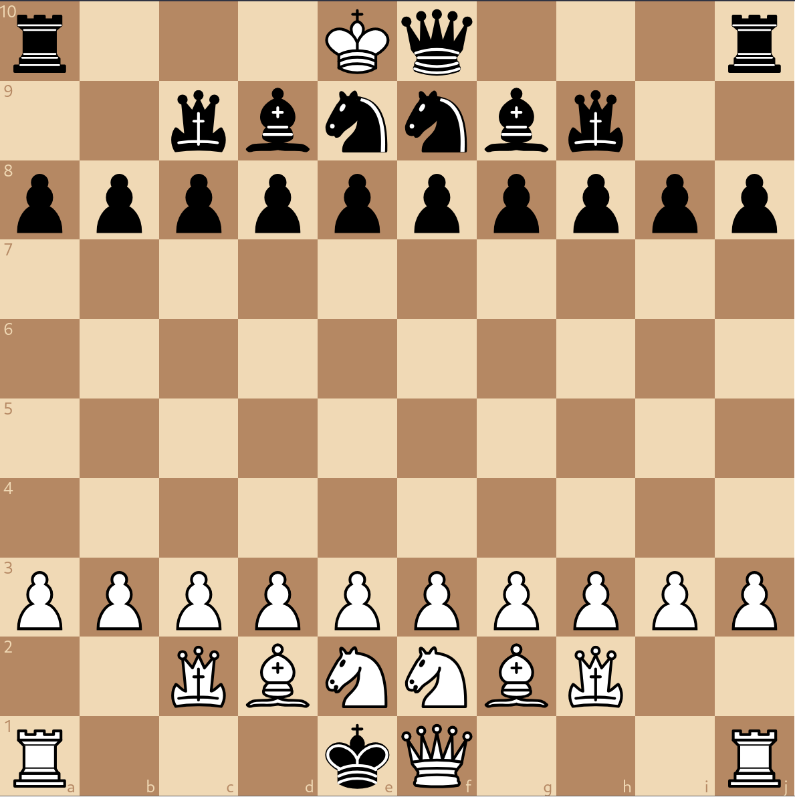
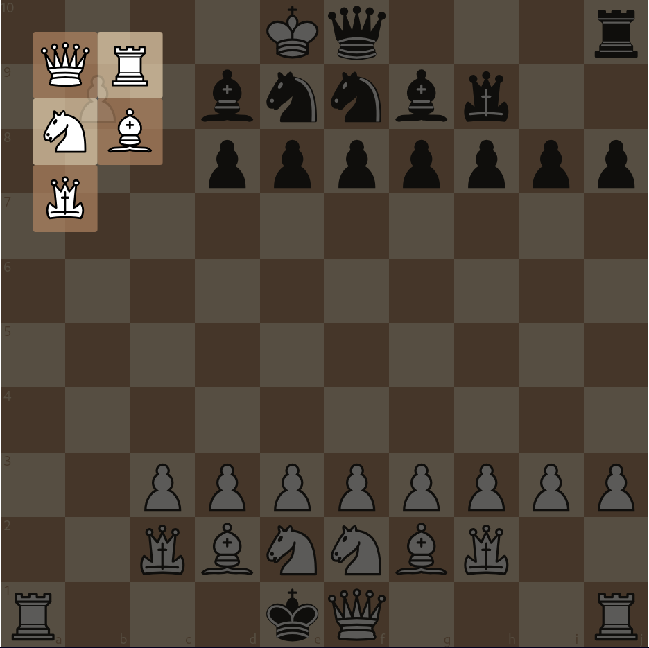

# Shtei: React project

Object of the game: unite your queen/sister (Shi) with your king/brother(Tei) by placing queen adjacent to king while having the same, or more attackers on your king. If your queen is taken, uniting cannot occur, and you lose instantly.

Whoever has more attackers on a king controls the movement of that king. If the number of attackers are the same, the king is controlled by it's intrinsic colour's team.

New pieces: Minister, Monk
Minister moves "like a king with extra range" -either 1 or 2 squares in all 8 directions.
Monk is a replacement to the queen while promoting a pawn. Monk moves like a queen would, but cannot be used to unite the king and win the game.

In the project directory, you can run:

### `npm start`

Runs the app in the development mode.\
Open [http://localhost:3000](http://localhost:3000) to view it in the browser.

The page will reload if you make edits.\
You will also see any lint errors in the console.
